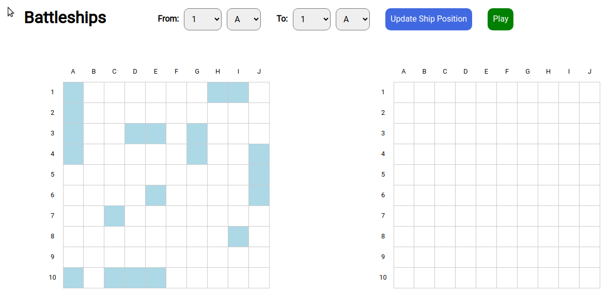

# Battleship

Battleship (also known as Battleships or Sea Battle) is a strategy-type guessing game for two players. It is played on ruled grids (paper or board) on which each player's fleet of warships is marked. The locations of the fleets are concealed from the other player. Players alternate turns calling "shots" at the other player's ships, and the objective of the game is to destroy the opposing player's fleet.

Click [here](https://lindelwa122.github.com/odin-battleship) for a live preview.

## The purpose of the project

This project aimed to practice test-driven development (TDD) and gain hands-on experience with Jest. The concept of kicking off with tests before diving into code proved helpful in dissecting the problem, understanding input-output scenarios, and devising algorithms. Interestingly, I found myself investing more time in crafting working algorithms for the game than writing tests. Additionally, it served as an opportunity to reinforce grid and other JavaScript concepts covered in the course.

## Credits

- This [project](https://www.theodinproject.com/lessons/node-path-javascript-battleship) is part of [The Odin Project](https://www.theodinproject.com).
